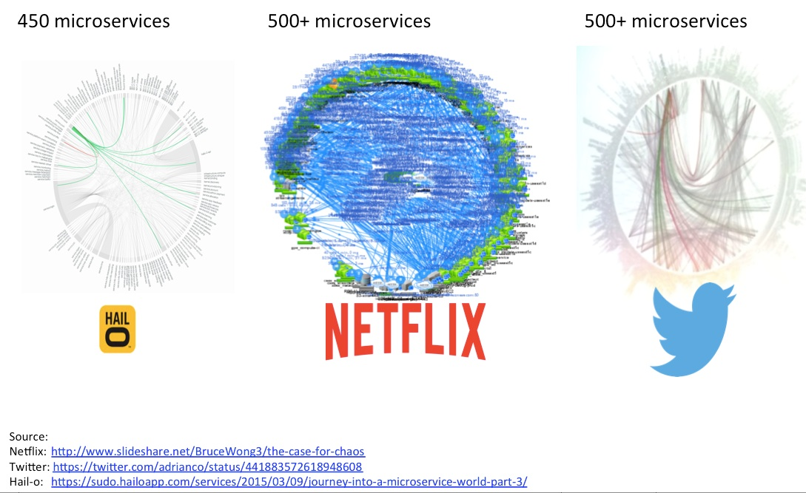
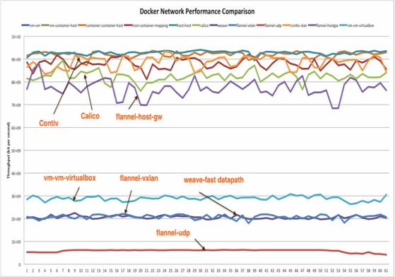
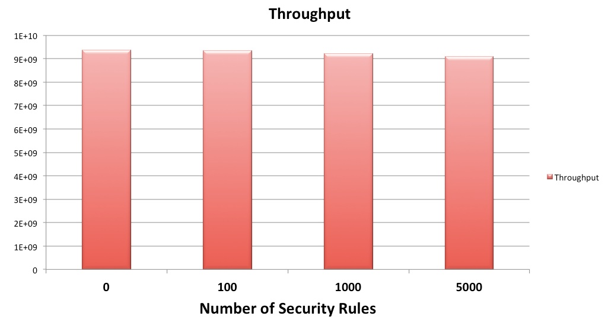

# Scaling Microservices with Contiv

Enterprises are moving their applications from monolithic architectures to Microservices architectures. When they are thinking about Microservices, they are also considering containerizing their applications. In this article, we’ll discuss some of the scale challenges of deploying containerized microservices. READMORE

There are two aspects of scaling. One is the operational aspect. How to operate large number of Microservices or containers with small number of human operators? How do you increase containers to human ratio( a ratio made popular by google)? Often this aspect gets ignored. You want to be thinking about 10s of thousands of containers per human operators. You should be embracing devops culture. You should think about self service deployments. If your developers need to file a ticket to provision something, you have already lost the battle. You should be thinking about deploying Microservices in seconds instead of hours.
Another aspect of scaling is the architectural aspect. How do you build large clusters? How do you deploy more number of containers per node? How can you deploy more containers per second? How can you serve more traffic from a container? How can you improve response time of your application?
We’ll look at both aspect of scaling in this article.

Project Contiv is an open source project. It provides policy based networking, storage and cluster management for containerized application. It works with all major schedulers like Kubernetes, Mesos and Docker swarm. Schedulers provide compute resources to your containers and Contiv provides networking and storage. In this article, we’ll mostly focus on networking.

## Challenges

Picture above shows what happens when you embrace Microservices and break up your monolithic J2EE style application into loosely coupled Microservices. These diagrams are affectionately called ‘death star diagrams’. Each of the dots on the perimeter of the circle is a Microservice. Lines between these dots are the API calls between one Microservice to another. One in the middle shows the Microservices at Netflix(one of the pioneers of Microservices architecture), one on the right is Twitter and one on the left is from Ridesharing company Hail-O. These companies are what you’d call a single application companies. Netflix has a single app – online video. Twitter has a single app – tweeting 140 characters. Yet, each of these companies have hundreds of Microservices.
Enterprises are not a single app companies. A typical large enterprise has hundreds of applications. Procurement systems, supply chain system, ERP system, CRM system, HR system, etc. You can only imagine how this picture will look like for a large enterprise.

This picture really makes some of the challenges obvious. First, lets step back and see what’s happening here. If you had a monolithic application, each one of these dots would have been a module and each of the links would have been a function or method call. JVM or a linker would have linked these modules together. You didn’t have to worry about how a method is routed to right module. You didn’t have to worry about discovery of the module or reliability of a method call.
When you broke up the monolith into multiple Microservices that scale out independently, you suddenly have to worry about making these API calls over a network. You have to worry about:
(i)	Routing these API calls to right Microservice
(ii)	About load balancing to scale out instances
(iii)	About monitoring health of service instances
(iv)	About timeouts, retries and making these API calls reliable in spite of failures. i.e. you have to design for failure.

Looking at this from an application developer perspective, We should be thinking about networking differently, where you don’t have to worry about Vlans, subnets and IP addresses. We should be thinking about networking as a dynamic linker that links all the Microservices together. We should be thinking about network as a service bus for your API calls. We designed Contiv to provide such a higher level of networking abstraction.

There is a second problem here that may not be as obvious. How do secure your application when there are hundreds of Microservices?
(i)	How do you know if one of them is compromised and skimming data from rest of the Microservices?
(ii)	How do you know if your compliance/governance rules are met?
(iii)	How do you know another Microservice isn’t accessing your database directly instead of using your API? (One of the things that’s different about Microservices from traditional SOA type of architectures is Microservices have no shared database. Each Microservice is responsible for its own data management).
(iv)	How do you secure them when service instances are ephemeral and are created and destroyed on-demand based on traffic.

Operationally, you need a way to secure your Microservices in a decentralized way.  No single admin can right thousands of lines of rules that can satisfy all requirements. You want infrastructure operator to specify high level policies and individual application owners to specify application specific policies. You want this to be completely self service. For the most part, you want consumers of a Microservice to specify the APIs they’ll consume. But, for critical systems you want to have the control who consumes the service.
We designed Contiv to provide that kind of decentralized and distributed security.

## Contiv Networking

As described earlier, Contiv is new kind of networking for your Microservices application. One of the goals of Contiv networking is to hide all the complexity of infrastructure from application developers and provide a higher layer of abstraction. So that developers can focus on solving bigger problems. Project Contiv works with multiple container schedulers like Kubernetes, Docker Swarm and Mesos.
There are just four simple concepts in Contiv networking. These concepts remain same across all three schedulers.

1.	Each tenant or a line of business has a virtual network. This virtual network is a just flat IP network. You can think of it as a virtual private cloud. You can be sure Contiv has you covered on basic networking front. Contiv has one of the best pure L3 implementation if your datacenter has spine-leaf topology. If you are a fan of overlays, we have a routed Vxlan implementation. Even if you have L2 VLAN topology because of legacy VMs, we have an enhanced L2 forwarding mode where broadcast ARPs are suppressed and you can have large subnets.
2.	There is a segment for every micro-service. Segment is just an arbitrary grouping of network endpoints. You can think of a segment as a firewall security zone. You can apply firewall security rules between segments. But, these segments don’t consume any network resources. So, you can have as many segments as you wish. This is what lets you deploy Microservices in a scalable way.
3.	There is network based service discovery, service routing / load balancing and service monitoring for each Microservice. This is really critical for scale out architectures. This is the part that acts as a network based dynamic linker for your Microservices.
4.	Security policies can be applied to (i) network (ii) a segment or (iii) a service.  These security policies are applied in a distributed manner on individual hosts.

## Implementation choices

We looked at various implementation choices for Contiv networking. Especially: how to do service routing and where to enforce security. We looked at Linux stack, IP tables, DPDK and Open Vswitch. We had to rule out DPDK since Linux containers are kernel level objects and they expect a netdev in their kernel namespace. Taking packets back to user space and switching in user space kills performance.

Next, we looked at Linux IP stack and IP tables. IP tables are really awesome and they have one of the best implementation of statefull firewall. But, IP tables have a scaling problem when it comes to scale out Microservices. The chart below is trying to highlight that problem. It shows a simple example of 50 Microservices, each talking to 10 other Microservices. It shows what happens when you starting scaling out number of instances in a Microservice.

Figure 1: Scaling IP table rules

You can see the red line in this chart that shows number of IP table rules increase exponentially. If you have service-A and service-B that need to talk to each other and each Microservice have 5 instances each, you need to install 25 iptable rules to allow all combinations. If you have 500+ Microservices like Netflix and 10s of scale out instances, number of IP table rules will run into millions.

We ended up building custom switching pipeline in kernel based on OpenVswitch.  We chose OpenVswitch because its fully programmable. Its software defined. With the custom pipeline, we could do network based services and security policies in a scalable way in a single pipeline. You can see how number of rules in Contiv pipeline remains same no matter how many scale out instances you have. This is because we map all containers to a segment and then apply security on a segment.

Figure 2: Container-networking performance comparison

The picture above shows performance comparison of various container-networking options. The blue line at the top is bare metal to bare metal throughput. The Orange line just below that is Contiv performance. This test was run on two bare metal servers in 10G NICs. You can see Contiv is very close to line rate. Some of the overlay networking options have low performance due to the overhead involved.

Figure 3: Performance with scale

Next, We measured the performance with lot of policies and here are the results. Chart here shows the throughput with 100, 1000 and 5000 security policies. You can see performance barely dips even at 5K policies. Again, this was measured between two servers with 10G Nics. We were trying to emulate Netflix like environment with 500 Microservices and each talking to 10 other Microservices on average. So, we measured the performance with 5K policies.

## Conclusion
As we saw, project Contiv provides a highly scalable networking for containerized Microservices.
