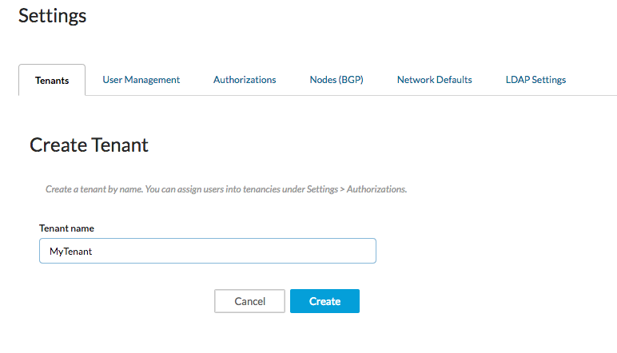

# Managing Tenants
Tenants are the highest level of organization in Contiv container networking. Roles and users access are determined on a per-tenant basis.

## Create Tenants
Create tenants and then you can assign the appropriate users and create networks. Users are authorized can view and use only the resources within their tenant, but can be assigned to multiple tenants.

To create tenants:

1. Select **Settings > Tenants**.
2. Click on **Create Tenants**.
   The Create Tenant tab displays.
   
3. Enter a tenant name and click **Create**.
   Note: Use numbers and letters. Capitals are okay. Do NOT use special characters or white spaces.

## Delete Tenants

If you are finished with a particular tenant, you can delete it. 

Before deleting the tenant, remove all user authorizations pointing to

To delete tenants:

1. Select **Settings > Tenants**.
2. Click on the name of the tenant you want to delete.
3. Click **Remove**.
4. Confirm that you want to remove the tenant. 
