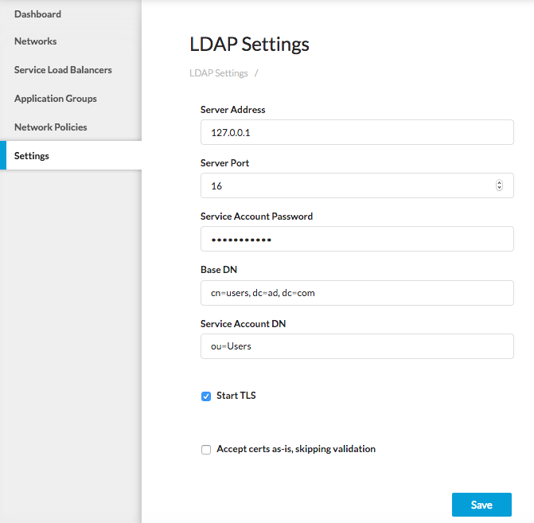

# Managing LDAP

You can set up LDAP access to leverage your existing user database and avoid duplicating users locally in Contiv. 

For additional security, you can enable the cryptographic protocol, Transport Layer Security (TLS) also known as SSL to connect securely to LDAP.  

To set up LDAP:

1. Select **Settings > LDAP Settings**.
   The LDAP Settings menu displays.
   
2. Enter the Server address for your LDAP server.
3. Enter the Server port for LDAP.
4. Enter your service account password to connect to LDAP.
   For security reasons, Contiv will not display this password.
5. Enter the Base DN. 
   For example, if you have a group of Container users at ad.com, enter cn=users, dc=ad, dc=com. 
6. Enter the Service Account DN. 
   Pick the service account for your user group, For example, ou=Users. 
7. If you want to connect to LDAP using SSL, select **Start TLS**.
8. If you want to speed up the connection, you can choose to **Accept cert as-is, skipping valdiation**.
9. Click **Save**.
