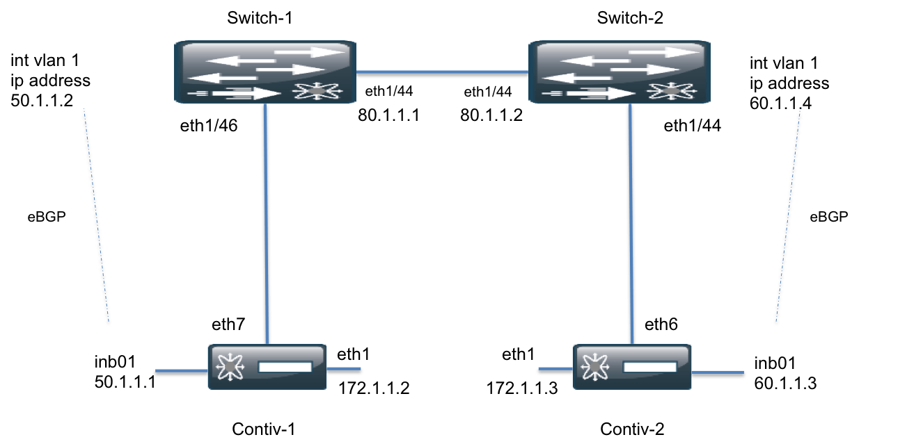

# Installing Contiv in a BGP L3 Setup

This page describes how to configure the Contiv infrastructure in L3 native VLAN mode.

The following figure shows a Contiv cluster with routing capabilites:



## Prerequisites

Follow the [Prerequisites](install-swarm.html#Prerequisites) and [Download](install-swarm.html#Download)
steps on the [Swarm Cluster](install-swarm.html) installation page. 
These steps install all of the required packages and binaries needed to start the Contiv infrastrure services. 

## Step 1: Run the Installer Script
Use the following command to run the installer script:

```
$chmod +x net_demo_installer
$./net_demo_installer -l
```
The `net_demo_installer` creates a `cfg.yaml` template file on the first run.

## Step 2: Specify the Configuration
Edit the `cfg.yaml` file to specify the interfaces and IP addresses of your cluster nodes.

The configuration file for a simple demo topology is shown below. A sample configuration file can be 
downloaded [here](extras/sample_cfg.yml).

```
CONNECTION_INFO:
      172.29.205.224:
        control: eth1
        data: eth7
      172.29.205.255:
        control: eth1
        data: eth6
```
*Note*: As shown in the topology diagram, the server's data interface,
not the management interface, should be the uplink interface.

## Step 3: Rerun the Installer
Rerun the installer after editing the `cfg.yaml` file.

```
./net_demo_installer -l
```

