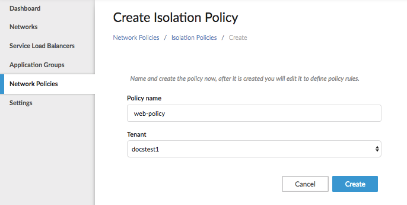
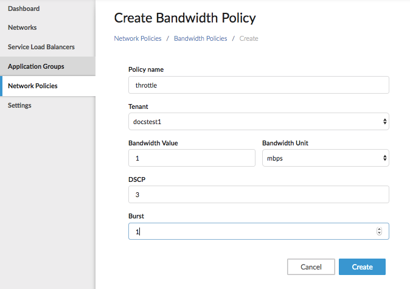

# Network Policies

Network policies describe rules for network resource usage, isolation rules, 
prioritization, and other network behavior on a group of containers.

There are two types of network policies you can create with Contiv:

* Bandwidth - limiting the overall resource use of a group
* Isolation - limiting the access of a group

This section covers how to create, update, and delete these policies.

## Network Isolation Policies

Network isolation policies enable white-list or black-list access control rules
to or from an application. Network isolation policies are particularly useful in 
securing an application tier. A group where an inbound policy is applied can 
be a service tier or another logical collection of containers that must be part of
a policy domain.

The following sections describe how to use UI or the Contiv Network CLI perform create, read, update, delete (CRUD) operations a network isolation policy. These actions can also be done with the Contiv Network REST API, which like the UI supports user authentication.

### Creating a Network Isolation Policy

Creating policies for the UI or CLI requires knowing your tenant ahead of time.  

####Creating an Isolation Policy Using the UI

Policy creation starts with a name for the Isolation Policy and a tenant. After these choices have been made, you can edit the isolation policy to meet your needs.

1\. From *Network Policies* > *Isolation Policies* click *Create*. <br>
<br>
2\. Select the tenant.<br>
3\. Click Create. <br>

#### Creating a Policy Using the CLI
You can create a policy using the `create` operation on a `policy` object. During creation, 
the policy must be supplied with a unique name in the `tenant` namespace.

The following command creates a policy named `web-policy`: 

```
$ netctl policy create web-policy
```

A network isolation policy can have access control list (ACL) -style whitelist 
or blacklist rules. A policy rule can specify the following information:

- `match criteria`: Specified using `protocol` and optionally a `port`. If match
criteria are not specified then the rule matches all traffic If only `protocol` is
specified but `port` is omitted, then the traffic matches all ports.
	- `protocol`: Layer3 (IP, ICMP) or Layer4 (TCP, UDP).
	- `port`: a TCP or UDP port number to or from which to permit or deny traffic.
	- `ip-address`: Can specify a masked IP address pool, which can be used to specify
a rules to or from the address pool. It is often useful to specify these rules to and from
non-container workloads.
- `direction`: Can be `inbound` or `outbound`, from the container 
application's point of view. An `inbound` rule is applicable to the traffic coming in 
*to* the containers; an `outbound` rule is applicable to the traffic 
going out *from* the container.
- `action`: A `permit` or `deny` action on the traffic that matches the rule. A
*white-list* set of rules is typically a set of `permit` actions followed by a 
rule to `deny` the rest.
- `priority`: Determines the execution order of the rules, producing a predictable behavior
for a set of arbitrary rules.
- `from-group`: Used to `permit` or `deny` traffic to or from specific containers, 
identified as a group.

For example, A policy to allow inbound access to `tcp/80` and `tcp/443` and deny all other traffic 
looks like this:

```
netctl policy rule-add web-policy 1 -direction=in -protocol=tcp -action=deny
netctl policy rule-add web-policy 2 -direction=in -protocol=tcp -port=80 -action=allow -priority=10
netctl policy rule-add web-policy 3 -direction=in -protocol=tcp -port=443 -action=allow -priority=10
```

### Associating a Network Isolation Policy to a Group
After defining a security policy, you associate it with a group 
on an existing network `contiv-net` as follows:

```
netctl group create contiv-net web-group -policy=web-policy
```

You run containers to be associated with `web-group` as follows:

For Docker or Swarm:

```
docker run -itd --net=web-group alpine /bin/sh
```

For Kubernetes: Specify the group association as a label `io.contiv.net-group`.
For example, a service (or pod) specification might look like:

```
apiVersion: v1
kind: ReplicationController
metadata:
  name: prod-web
spec:
  replicas: 2
  selector:
    app: prod-web
  template:
    metadata:
      labels:
        app: prod-web
        io.contiv.net-group: web-group
    spec:
      containers:
      - name: prod-web
        image: alpine
        command:
          - /bin/sh
```

Kubernetes offers richer options for selection criteria because of the `selector` concept,
which allows arbitrary selection of collections of labels to form a dynamic
`group`. For example, a collection of {'prod', 'web'} ond {'stage', 'db', 'low-latency'} 
can both be implicit groups . 

To use this feature, Kubernete's native policy object must be used, available in 
Kubernetes Release 1.3 and later.

### Reading, Updating, and Deleting a Network Isolation Policy
The `netctl` utility or the equivalent REST APIs can be used to perform other operations on the policy.
For example, the following lists all of the usable policies:

```
$ netctl policy ls
Tenant   Policy
------   ------
default  web-policy

```

The following lists all the rules in the policy:

```
$ netctl policy rule-ls web-policy
Incoming Rules:
Rule  Priority  From EndpointGroup  From Network  From IpAddress  Protocol  Port  Action
----  --------  ------------------  ------------  ---------       --------  ----  ------
1     1                                                           tcp       0     deny
2     10                                                          tcp       80    allow
3     10                                                          tcp       443   allow
Outgoing Rules:

```

To add a new rule to an existing policy, use:

```
$ netctl policy rule-add web-policy 4 -direction=in -protocol=tcp -port=8080 -action=allow -priority 10

$ netctl policy rule-ls web-policy
Incoming Rules:
Rule  Priority  From EndpointGroup  From Network  From IpAddress  Protocol  Port  Action
----  --------  ------------------  ------------  ---------       --------  ----  ------
1     1                                                           tcp       0     deny
3     10                                                          tcp       443   allow
4     10                                                          tcp       8080  allow
2     10                                                          tcp       80    allow
Outgoing Rules:
Rule  Priority  To EndpointGroup  To Network  To IpAddress  Protocol  Port  Action
----  --------  ----------------  ----------  ---------     --------  ----  ------

```

To delete an existing rule, use the `rule-id` specified in the `rule-delete`
command:

```
netctl policy rule-rm web-policy 4
```

Finally, to delete a policy, use the `delete` verb on the policy:

```
netctl policy delete web-policy
```

### Deleting or Updating a Group
The `netctl` utility or equivalen REST APIs can be use to perform CRUD operations on a `group` object.
For example, to delete a group, use:

```
netctl group delete web-group
```

*Note*: You must delete containers and policies associated with a group before deleting
the group. The `netctl group delete` command fails if any containers still belong to the
group or if any policies are still associated with the group. 

Use the `create` verb to update a group to use a different policy:

```
netctl group create contiv-net web-group -policy=new-web-policy
```

### Associating Multiple Policies with a Group
The policy system is dynamic in the following two ways:

- Policy rules can be altered after the policy is defined.
- Policy associations can be added to or removed from a group of containers at any time.

This section examines specifying a category of rules to be defined as atomic
units of policy that can be manipulated and applied across a group of containers
in a flexible manner, and also be updated after the group is defined and created.

Consider the creation of a `staging-web-group` that exposes not only the web ports
but also some ports for diagnostics purposes. For this use case, define two policies
called `allow-web` and `allow-diags` as follows:

```
$ netctl policy create allow-web
$ netctl policy rule-add allow-web 1 -direction=in -protocol=tcp -action=deny
$ netctl policy rule-add allow-web 2 -direction=in -protocol=tcp -port=80 -action=allow -priority=10
$ netctl policy rule-add allow-web 3 -direction=in -protocol=tcp -port=443 -action=allow -priority=10
$ netctl policy rule-ls allow-web
Incoming Rules:
Rule  Priority  From EndpointGroup  From Network  From IpAddress  Protocol  Port  Action
----  --------  ------------------  ------------  ---------       --------  ----  ------
1     1                                                           tcp       0     deny
2     10                                                          tcp       80    allow
3     10                                                          tcp       443   allow

$ netctl policy create allow-diags
$ netctl policy rule-add allow-diags 1 -direction=in -protocol=icmp -action=allow
$ netctl policy rule-ls allow-diags
Incoming Rules:
Rule  Priority  From EndpointGroup  From Network  From IpAddress  Protocol  Port  Action
----  --------  ------------------  ------------  ---------       --------  ----  ------
1     1                                                           icmp      0     allow
```

Now associate both of these policies to a group called `staging-web-group`:

```
$ netctl group create contiv-net stage-web-group -policy=web-policy -policy=allow-diags

$ netctl group ls
Tenant   Group            Network     Policies
------   -----            -------     --------
default  stage-web-group  contiv-net  web-policy,allow-diags
```

You can now run a container that belongs to `stage-web-group` as following and
expect both of the policies be applied to any traffic to the container(s):

```
$ docker run -itd --net=stage-web-group --name=c1 alpine /bin/sh
```

If you withdraw the `allow-diags` policy, all rules corresponding to the policy
are withdrawn automatically. The withdrawl of a policy is done by providing the updated
list of new policies associated with a group, for example:

```
$ netctl group create contiv-net stage-web-group -policy=web-policy
$ netctl group ls
Tenant   Group            Network     Policies
------   -----            -------     --------
default  stage-web-group  contiv-net  web-policy
```

### Associating a Policy with Multiple Groups
A policy can be applied to multiple groups. In other words, a policy is reusable across groups.
For example, `allow-diags` can be used by `dev-web-group` or `staging-web-group` or both
as follows:

```
$ netctl group create contiv-net dev-web-group -policy=allow-diags
$ netctl group ls
Tenant   Group            Network     Policies
------   -----            -------     --------
default  stage-web-group  contiv-net  web-policy,allow-diags
default  dev-web-group    contiv-net  allow-diags
```

Any update to the policy rules is applied to all the groups a policy is associated with. 
This allows a structured way of creating a block of policies that can be reused, reassigned
and repurposed dynamically.

## Network Bandwidth Limiting

Network bandwidth policies specify the bandwidth limits on all containers
that belong to a group. These policies "throttle" the bandwidth of every
container belonging to a specific group.


###Creating a Bandwidth Policy using the UI

Policy creation starts with a name for the Bandwidth Policy and a tenant. After these choices have been made, you can edit the isolation policy to meet your needs.

1\. From *Network Policies* > *Bandwidth Policies* click *Create*.<br>
<br>
2\. Select the tenant.<br>
3\. Click Create. <br>
4\. Now that you have the policy created, you can set the bandwidth limitation in Mbps. 
    Note: You must choose a burst greater than 1500 bytes.<br>

###Creating a Bandwidth Policy using the CLI

Policies like network isolation apply between two groups, whereas other policies,
including network bandwidth allocation, affect a group or containers within a group.

A `netwrok-profile` describes various attributes that apply to a group, for example
network bandwidth limits. A `network-profile` can be created as follows:

```
$ netctl netprofile create -b 1Mbps -dscp 3 dev-net-profile
Name			Tenant		Bandwidth	DSCP
----			------  	---------	----
dev-net-profile		default		1Mbps		3
```
This network profile limits associated containers to a network bandwidth of 1Mbps and 
sets their DSCP (Differentiated Services Code Point, or type of service) bits in the IP header.

After creation, a profile can be associated with a group:

```
$ netctl group create contiv-net dev-web-group -policy=allow-diags -networkprofile=dev-net-profile
$ netctl group ls
Tenant   Group            Network     Policies			Network Profile
------   -----            -------     --------			---------------
default  stage-web-group  contiv-net  web-policy,allow-diags	default
default  dev-web-group    contiv-net  allow-diags		dev-net-profile
```

At this point the bandwidth policy is in force on the `dev-web-group`.

### Using Traffic Prioritization for Network-Wide Application Behavior

*Note*: This section is for more advanced network administrators and engineers.

If a physical network is configured with the classes of traffic identified with DSCP, then
a DSCP marking can achieve an end to end application behavior. For example, most of the
physical network switching vendors, like Cisco, provide a way to allow use of network
bandwidth and traffic scheduling based on DSCP. Configuring physical network devices is
out of scope for this document; however, it is worth noting that these features provide:

- Bandwidth allocation: Specify how much packet buffering is allocated to a given class of service (CoS).
- Bandwidth rate limiting: Rate-limit the traffic belonging to a class and specify
the rules of traffic precedence during bursts or contention. This can provide
network predictability to classes of traffic.
- Traffic scheduling: Usually the default scheduling policy on a switch is to round-robin
the traffic towards different destinations. In cases of contention, however, a more sophisticated
scheduling policy can be defined based on DSCP.

The integration of DSCP prioritization with an application can contribute to predictable 
behavior for network and/or storage traffic.
