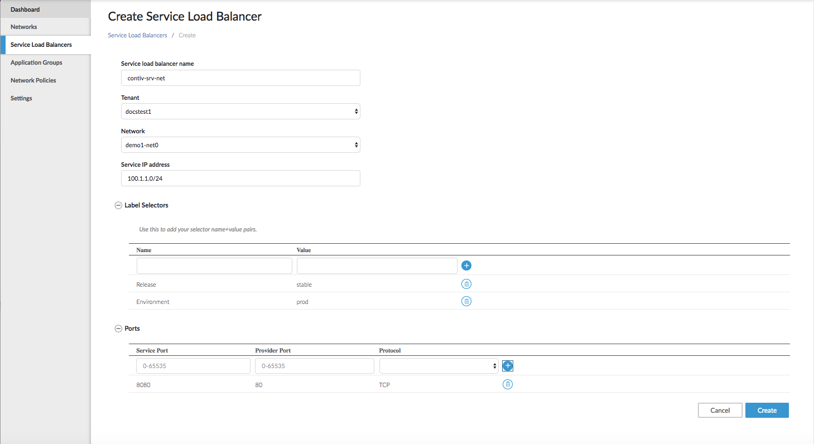

# Service Load Balancing

A service provides network connection on a set of ports to a cluster of  containers matching the service label selector. 

Services offer:

- Easy scaling up and down. 
- Efficient load balancing.
- Minimal downtime.

A provider is one or more containers that match the label selector associated with the services.
 **Note**: This feature would be deprecated since docker 1.12 onward service load balancer feature  is supported natively by docker swarm. 

## Defining Services

After you create your network, you can define services using the UI, the `netctl` command line interface (CLI), or the Contiv Network REST APIs, but it is recommended
to use the UI or API to take advantage of the authentication and authorization options in those interfaces.

**Note**: Service requirements are defined by *selectors*. Selectors are key-value pairs 
that group providers with matching labels. 

### To create a Service Load Balancer using netctl:
 
1\. Create network as net0-2 in default tenant

	netctl network create net0-2 -s 10.0.0.0/24 -g 10.0.0.254 -encap vxlan -t default

2\. Create service network as svc-net-2-0 in default tenant

	netctl network create svc-net-2-0 -s 30.2.0.0/24 -g 30.2.0.254 -encap vxlan -t default

3\. Create service on service network as svc-0-default in default tenant

	netctl service create svc-0-default --network svc-net-2-0 -t default --selector=key0=value1 --selector=key1=value2 --selector=key2=value3 --selector=key3=value4 --port=80:8080:TCP --port=643:7070:UDP


4\. Verify service name and its IPs.   

```
[vagrant@netplugin-node1 ~]$ netctl service ls
ServiceName    Tenant    Network      Selectors
---------      --------  -------      -------
svc-0-default  default   svc-net-1-0  [key0=value1 key1=value2 key2=value3 key3=value4]

[vagrant@netplugin-node1 ~]$ netctl service inspect svc-0-default
----
----
       "labels": "map[key0:value1 key1:value2 key2:value3 key3:value4]",
       "macAddress": "02:02:0a:00:00:08",
       "network": "net0-1.default",
       "serviceName": "svc-0-default"
      }
    ],
    "serviceVip": "30.1.0.1" 
  }
```

4\. Create four service containers in network net0-2
	
    docker run -itd --name=net0-2-srv0-0-0 --net=net0-2  contiv/alpine  sleep 600m
    docker run -itd --name=net0-2-srv1-1-1 --net=net0-2  contiv/alpine  sleep 600m
    docker run -itd --name=net0-2-srv2-2-2 --net=net0-2  contiv/alpine  sleep 600m
    docker run -itd --name=net0-2-srv3-0-3 --net=net0-2  contiv/alpine  sleep 600m

5\. Similarly create  provider containers as service backend containers 
	
    docker run -itd --name=srv-default-net0-2-20-3 --net=net0-2  --label=key0=value1 --label=key1=value2 --label=key2=value3 --label=key3=value4  contiv/alpine sleep 600m
    docker run -itd --name=srv-default-net0-2-21-1 --net=net0-2  --label=key0=value1 --label=key1=value2 --label=key2=value3 --label=key3=value4  contiv/alpine sleep 600m
    docker run -itd --name=srv-default-net0-2-22-2 --net=net0-2  --label=key0=value1 --label=key1=value2 --label=key2=value3 --label=key3=value4  contiv/alpine sleep 600m
    docker run -itd --name=srv-default-net0-2-23-0 --net=net0-2  --label=key0=value1 --label=key1=value2 --label=key2=value3 --label=key3=value4  contiv/alpine sleep 600m

6\. Run Service  instances on provider containers(TCP server at ports 8080 and 7070) i.e Use netcat utility to run server 

    docker exec -it srv-default-net0-2-20-3  nc -lk -p 7070 -e /bin/true &
    docker exec -it srv-default-net0-2-21-1  nc -lk -p 7070 -e /bin/true &
    docker exec -it srv-default-net0-2-22-2  nc -lk -p 7070 -e /bin/true &
    docker exec -it srv-default-net0-2-23-0  nc -lk -p 7070 -e /bin/true &
    docker exec -it srv-default-net0-2-20-3  nc -lk -p 8080 -e /bin/true &
    docker exec -it srv-default-net0-2-21-1  nc -lk -p 8080 -e /bin/true &
    docker exec -it srv-default-net0-2-22-2  nc -lk -p 8080 -e /bin/true &
    docker exec -it srv-default-net0-2-23-0  nc -lk -p 8080 -e /bin/true & 

7\. login into service conatiners and connect to service  i.e Use netcat utility to run client to connect service

    docker exec -it net0-2-srv1-1-1  nc -z -n -v -w 1  30.2.0.1 80
    docker exec -it net0-2-srv3-0-3  nc -z -n -v -w 1  30.2.0.1 80
    docker exec -it net0-2-srv2-2-2  nc -z -n -v -w 1  30.2.0.1 80
    docker exec -it net0-2-srv0-0-0  nc -z -n -v -w 1  30.2.0.1 80
	


	 

### To create a Service Load Balancer using the UI:

1\. From *Service Load Balancer*, click *Create Service Load Balanacer*. 
<br>
   The Create Service Load Balancer page displays.<br>
   
2\. Choose a name for the service load balancer. <br>
3\. Select the tenant.<br>
4\. Select the network. <br>
5\. Enter the *Service IP* address.<br>
6\. Under *Label Selectors* choose you label name and value.<br>
7\. Choose your *Service* and *Provider* ports and your *Protocol*.<br>
8\. Click *Create*.<br>


To create a Service Load Balancer, using the CLI, run:

```
netctl net create [$SERVICE_NAME] -s [$SERVICE_IP_ADDRESS]

netctl service create [$APP_SERVICE_NAME] --network [$NETWORK_NAME] --tenant [$TENANT_NAME] selector=[$selector1] --selector=[$selector2] --selector=[$selector3] --port [$SERVICE_PORT]:[$PROVIDER_PORT]:[$PROTOCOL]
```

For example, to create a web service in a web tier for which providers must be stable and production-ready:

```
netctl net create contiv-srv-net -s 100.1.1.0/24

netctl service create app-svc --network contiv-srv-net --tenant default --selector=tier=web --selector=release=stable --selector=environment=prod --port 8080:80:TCP
```

<!--## Demonstration of Reachability to a Service from the Client Containers

The following example uses the *netcat* (`nc`) command to start listeners on each of the providers:

```
docker exec -it 2c30b978c87bad64ced1f8158b72d17abf7748889464023d4e23a4bd24ae2d28 sh
#nc -l -p 80 &

docker exec -it 3a23aa2d5891153999871544362b881fcd461e46021007453e0e6e7edf06b348 sh
#nc -l -p 80 &

docker exec -it ef6691ebb26ea54749242606ec23be01903f886f58382e346ec61369aab39073 sh
#nc -l -p 80 &

docker exec -it 2a3ac3917e54775081e2afc40ce6d718e7871d4814a6fd387ecf4eca16fc2474 sh
#nc -l -p 80 &
```

Finally, the following example does three things:

- Creates a network for a client (consumer of the service). 
- Starts the client container. 
- Uses netcat to attempt to reach the service IP (service IP allocated in our example is 100.1.1.3) on the service port.

```
netctl net create client-net -s 11.1.1.0/24 -g 11.1.1.254

docker run -itd --net=client-net  alpine sh
9e6842a59369ba67d6224c1502ab0e68360fe7aaa0949a04462a9ae0bdbc6830

docker exec -it 9e6842a59369ba67d6224c1502ab0e68360fe7aaa0949a04462a9ae0bdbc6830 sh
# nc -znvw 1 100.1.1.3 8080
100.1.1.3 (100.1.1.3:8080) open
```

*Note*: The service IP can also be a preferred IP address. This can be enforced while creating the service configuration with the `-ip` option.
-->
