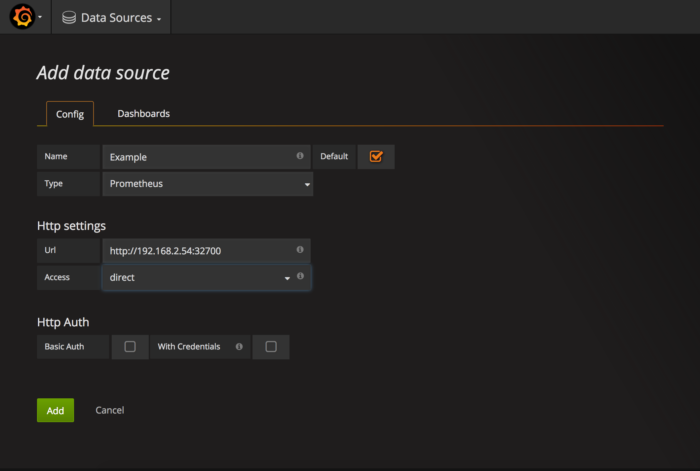
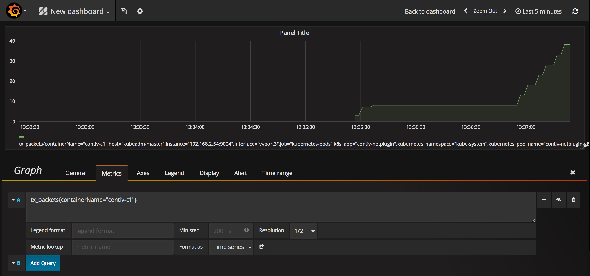

## Data Analytics with Prometheus and Grafana for Kubernetes

- [Setup](#setup)
- [Chapter 1 - Prometheus and Grafana](#ch1)
- [Chapter 2 - Basic Ping Example](#ch2)
- [Resources](#resources)

This walks through the setup for Prometheus and Grafana and an example that may be useful for troubleshooting connectivity issues within your cluster.

### <a name="setup"></a> Setup

Please finish the [Container Networking Tutorial](/documents/tutorials/networking-kubernetes-16.html), but do not clean up your cluster.

In order to install Prometheus and Grafana, please follow these steps.

```
$ cd install/cluster/
$ vagrant ssh kubeadm-master
[vagrant@kubeadm-master ~]$ cd contiv-*
[vagrant@kubeadm-master contiv-1.2.0]$ cd install/k8s/configs/
[vagrant@kubeadm-master configs]$ pwd
/home/vagrant/contiv-1.2.0/install/k8s/configs
[vagrant@kubeadm-master configs]$ sudo -i
[root@kubeadm-master ~]# cd /home/vagrant/contiv-1.2.0/install/k8s/configs
[root@kubeadm-master configs]# cp prometheus.yml /var/contiv/prometheus.yml
[root@kubeadm-master configs]# exit
exit
```
```
[vagrant@kubeadm-master configs]$  kubectl create -f contiv-prometheus.yml
clusterrole "prometheus" created
serviceaccount "prometheus" created
clusterrolebinding "prometheus" created
replicaset "contiv-prometheus" created
service "prometheus" created

[vagrant@kubeadm-master configs]$ kubectl create -f contiv-grafana.yml
clusterrole "grafana" created
serviceaccount "grafana" created
clusterrolebinding "grafana" created
replicaset "contiv-grafana" created
service "grafana" created

[vagrant@kubeadm-master configs]$ cd
```

Check if Contiv's `stats_exporter` is running as a sidecar container in the netmaster and netplugin kubernetes pods.

```
[vagrant@kubeadm-master configs]$ kubectl get pods -n=kube-system | grep 'netplugin\|netmaster'
contiv-netmaster-425jp                   3/3       Running   0          2d
contiv-netplugin-75dxx                   2/2       Running   0          2d
contiv-netplugin-zhbrd                   2/2       Running   0          2d

[vagrant@kubeadm-master configs]$ kubectl describe pod -n=kube-system contiv-netmaster-425jp | grep stats
    Image:          contiv/stats
    Image ID:       docker-pullable://docker.io/contiv/stats@sha256:9dc89b719703cfbd5f3459a4976336c42d470e9eaa9769de647c1ce3486f8e8b

[vagrant@kubeadm-master configs]$ kubectl describe pod -n=kube-system contiv-netplugin-75dxx | grep stats
    Image:          contiv/stats
    Image ID:       docker-pullable://docker.io/contiv/stats@sha256:9dc89b719703cfbd5f3459a4976336c42d470e9eaa9769de647c1ce3486f8e8b

[vagrant@kubeadm-master configs]$ kubectl describe pod -n=kube-system contiv-netplugin-zhbrd | grep stats
    Image:          contiv/stats
    Image ID:       docker-pullable://docker.io/contiv/stats@sha256:9dc89b719703cfbd5f3459a4976336c42d470e9eaa9769de647c1ce3486f8e8b
```

Check if `stats_exporter` exposes metrics for Prometheus to scrape.

```
[vagrant@kubeadm-master configs]$ curl localhost:9004/metrics

[vagrant@kubeadm-master configs]$ curl localhost:9005/metrics

```

### <a name="ch1"></a> Chapter 1: Prometheus and Grafana

Prometheus is an open source monitoring platform that is useful for visualizing time series data. You can monitor and get alerts for your cluster through Prometheus. You can find out more about Prometheus [here](https://prometheus.io/).

Grafana is an open source data visualization platform which further enhances the user experience. In this tutorial, you will learn how Grafana can visualize the data stored in Prometheus and how to run some useful queries in the Grafana dashboard. For more information on Grafana, click [here](https://grafana.com/).

Let's explore Prometheus and Grafana.

Prometheus and Grafana are running as NodePorts which are exposed on the host IP. Since they are both configured to run on the master node, let's find out the IP of the master node.

```
[vagrant@kubeadm-master ~]$ kubectl describe nodes kubeadm-master
```
We can see that its IP is 192.168.2.54.

We can also find out what port Prometheus is exposed at.

```
[vagrant@kubeadm-master ~]$ kubectl get svc -n kube-system
NAME         CLUSTER-IP       EXTERNAL-IP   PORT(S)          AGE
grafana      10.107.61.77     <nodes>       3000:32701/TCP   25m
kube-dns     10.96.0.10       <none>        53/UDP,53/TCP    58m
prometheus   10.101.101.193   <nodes>       9090:32700/TCP   25m
```
Open a browser and navigate to http://192.168.2.54:32700. This will open up the Prometheus UI.

Let's check and make sure that Prometheus is able to fetch data from all the nodes. At the top click on Status and in the drop down menu click on Targets. You should see a list of targets and that they are `UP` and green. If it says `UNKNOWN` it is likely because the environment or prometheus is still configuring.

Go back to Graph from the top tool bar. Click on the drop down menu that says `-insert metric at cursor-` and pick any metric. Then click on `Execute` and `Graph` right below the `Execute` button.

Now let's move to Grafana. 

Grafana is exposed at port 32701, so let's navigate to http://192.168.2.54:32701 in our browser. The Grafana UI will open up and prompt you for a username and password. Username is "admin" and password is "admin". We will be working with Grafana for the remainder of this tutorial because its UI is more user friendly.

After you have logged in, you will see an option to `Add data source`. Click on that. Fill out the information as shown in the following screenshot.



Click on `Add` and `Save & Test`.

Click on the Grafana logo in the top left of the screen and go to Dashboard and click on `New`.
Click on `Graph`. Click on "Panel Title" and then click on "Edit".

### <a name="ch2"></a> Chapter 2: Basic Ping Example

Now go back to your terminal which has the cluster running. You should already have a `contiv-net` network setup as part of the Networking Tutorial as well as the `contiv-c1` and `contiv-c2` pods up and running.

```
[vagrant@kubeadm-master ~]$ netctl net ls
Tenant   Network      Nw Type  Encap type  Packet tag  Subnet        Gateway    IPv6Subnet  IPv6Gateway  Cfgd Tag
------   -------      -------  ----------  ----------  -------       ------     ----------  -----------  ---------
default  default-net  data     vxlan       0           20.1.1.0/24   20.1.1.1
default  contiv-net   data     vxlan       0           10.1.2.0/24   10.1.2.1
default  contivh1     infra    vxlan       0           132.1.1.0/24  132.1.1.1
...


[vagrant@kubeadm-master ~]$ kubectl get pods
NAME        READY     STATUS    RESTARTS   AGE
contiv-c1   1/1       Running   0          24s
contiv-c2   1/1       Running   0          9s
...
```

Now let's go back to the Grafana UI and add the following four queries.

```
rx_packets{containerName="contiv-c1"}
rx_packets{containerName="contiv-c2"}
tx_packets{containerName="contiv-c1"}
tx_packets{containerName="contiv-c2"}
```

Go back to the terminal and set up a ping between the two pods.

```
[vagrant@kubeadm-master ~]$ kubectl exec -it contiv-c1 sh
/ # ping 10.1.2.3
```
Now if we go back to the Grafana Dashboard, we should see that the number of packets transmitted increases, so our basic ping works.



The way the data is displayed shows a monotonically increasing counter. This may not be the most ideal way to display your data, in which case you can also graph deltas. `idelta()` is a query function that takes a range vector of the metric you want to graph. A range vector is a list of datapoints over a period of time. For example, you can graph the received bytes over a one day span with the following query.

`idelta(rx_packets{containerName="contiv-c1"}[1d])`

As you go through the rest of the Networking and Policy Tutorials, you can keep experimenting with different queries and viewing graphs on Grafana.

### <a name="resources"></a> Resources

For more query functions, find them [here](https://prometheus.io/docs/querying/functions/).

### Improvements or Comments
This tutorial was developed by Contiv engineers. Thank you for trying out this tutorial.
Please file a GitHub issue if you see an issue with the tutorial, or if you prefer
improving some text, feel free to send a pull request.
